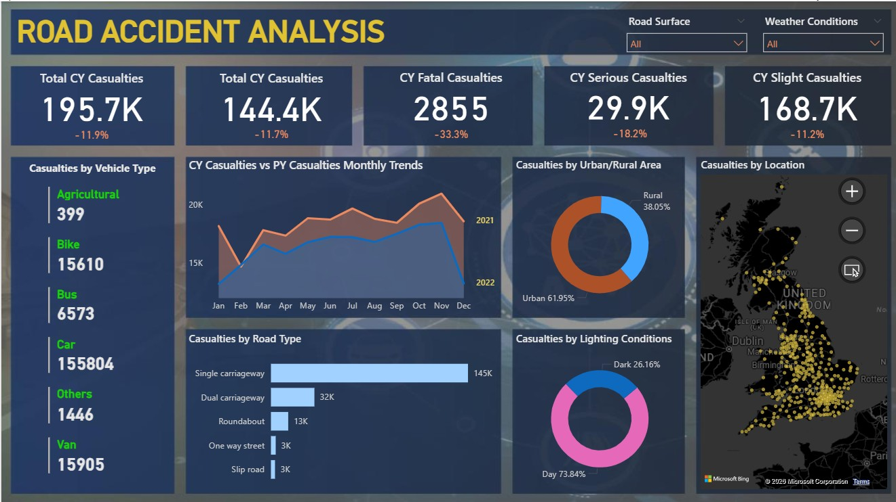

# Road Accident Analysis Dashboard (SQL + Power BI)

## Project Overview
This project analyzes road accident and casualty data for the years 2021 and 2022.  
The aim is to understand accident severity, vehicle involvement, location hotspots, and changes in casualty trends over time.  

SQL was used for initial data extraction, cleaning, and validation, and Power BI was used for data modelling, DAX-based KPI creation, and designing the interactive dashboard.  
The dashboard supports government authorities, road safety departments, and policy makers in making informed decisions related to accident prevention and traffic management.

---

## Objectives
1. Compare road accident trends between the current year (CY) and previous year (PY).  
2. Analyze severity levels: fatal, serious, and slight casualties.  
3. Identify which vehicle types contribute most to accidents.  
4. Study accident distribution across different road types.  
5. Compare accidents in urban vs rural areas.  
6. Analyze day vs night accident trends.  
7. Map accident hotspots using geospatial visualization.  
8. Provide actionable insights that help improve road safety.

---

## Dataset Description
The dataset contains accident-level information, including:
- Accident reference ID  
- Date and time of accident  
- Vehicle type involved  
- Road type (single carriageway, dual carriageway, roundabout, etc.)  
- Weather and lighting conditions  
- Urban vs rural classification  
- Latitude and longitude (for map plotting)  
- Casualty counts: fatal, serious, slight  

---

## Data Cleaning & Preparation (SQL + Power Query)

### SQL Cleaning Tasks
- Removed duplicate accident records.  
- Standardized inconsistent labels (e.g., road types, lighting conditions).  
- Filtered invalid rows with missing coordinates or incomplete severity details.  
- Validated dates to ensure accurate year-wise comparison.  
- Joined multiple tables (accidents, casualties, vehicles) into a consolidated dataset.  

### Power Query Cleaning Tasks
- Final cleaning and text standardization.  
- Handled missing values in lighting, weather, and road condition fields.  
- Ensured casualty totals matched severity-level counts.  
- Created structured tables for modelling in Power BI.

---

## Key KPIs Developed (DAX)
- **Total Casualties (CY & PY)**  
- **Total Accidents (CY & PY)**  
- **Year-over-Year Casualty Growth %**  
- **Fatal Casualties**  
- **Serious Casualties**  
- **Slight Casualties**  
- **Accidents by Vehicle Type**  
- **Casualties by Road Type**

These KPIs help understand yearly performance and accident severity distribution.

---

## Dashboard Components

### 1. Year-on-Year Monthly Trend  
A line chart comparing monthly casualties in CY vs PY, helping identify months with spikes or improvement.

### 2. Casualties by Vehicle Type  
Shows which vehicles (cars, bikes, vans, buses, etc.) contribute most to accidents and casualties.

### 3. Urban vs Rural Casualties  
Breakdown of accidents based on region type, showing where safety interventions are needed most.

### 4. Casualties by Road Type  
Distribution of casualties across road types such as single carriageway, dual carriageway, roundabout, etc.

### 5. Day vs Night Accidents  
Analyzes whether accidents mostly occur in daylight or darkness, helping identify risk patterns.

### 6. Hotspot Map (Geospatial Analysis)  
A map visual plotting accident locations using latitude and longitude to identify high-risk zones.

---

## Insights Generated
1. Casualties decreased slightly from the previous year, but specific months still show concerning spikes.  
2. Cars and two-wheelers contribute a major share of casualties, indicating the need for targeted awareness and monitoring.  
3. Single carriageways record the highest accidents, revealing potential road design or speeding issues.  
4. Most accidents occur during the day, meaning visibility is not the primary factor—speed, congestion, and distraction may be.  
5. Urban areas show more incidents overall, but certain rural locations emerge as high-severity hotspots.  
6. Location mapping helps authorities prioritize dangerous stretches for infrastructure improvement.

---

## Tools Used
- SQL  
- Power BI  
- Power Query  
- DAX  

## Dashboard

---

## Final Output
The final dashboard presents a complete analytical view of road accident trends, severity levels, vehicle involvement, and high-risk locations.  
It enables authorities to take data-driven actions such as improving road design, planning patrols, launching awareness drives, and enhancing traffic rules.

